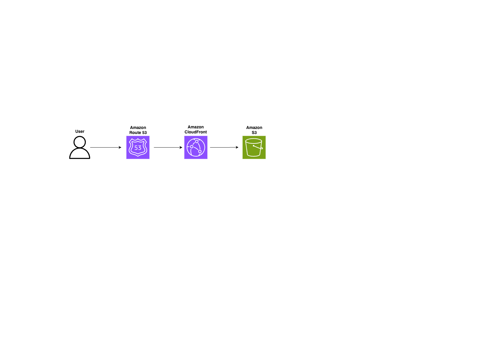

# Architecture Diagram

This diagram illustrates the architecture of the static website hosting solution built for this project.

The request flow is:

1. User sends a request to the website.
2. Amazon Route 53 resolves the domain name.
3. Amazon CloudFront delivers the content through the global CDN.
4. Amazon S3 hosts the static website files (HTML, CSS and assets).

This architecture provides:

- Global content delivery with low latency
- HTTPS support through CloudFront
- Highly durable object storage with Amazon S3
- Scalable and cost-effective static website hosting

