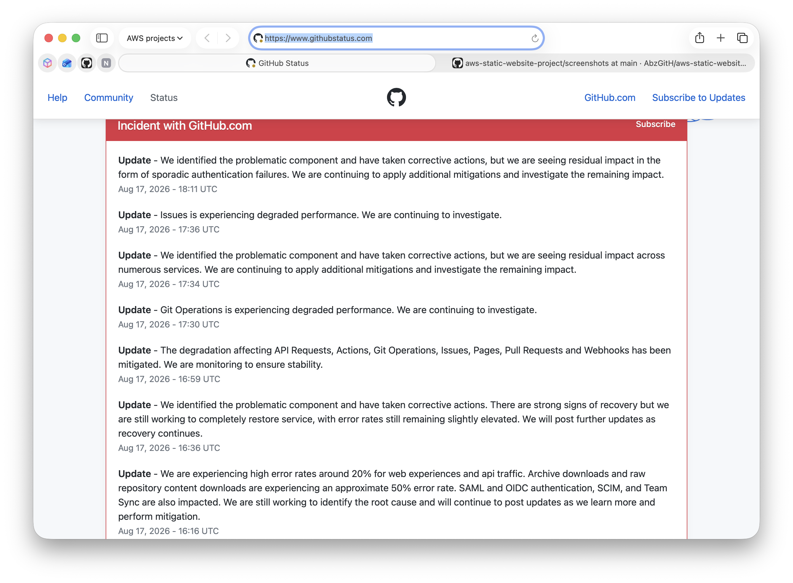

# Troubleshooting Report

**Project:** AWS Static Website Project

**Date:** August 2026

## Issue

Deployment screenshots and architecture diagrams failed to render within the GitHub README despite displaying correctly in Visual Studio Code, existing in the repository, and being committed and pushed successfully.

---

## Objective

Determine whether the image rendering issue was caused by:

- Incorrect Markdown syntax.
- Incorrect file paths or filenames.
- Git configuration.
- Repository configuration.
- Image file format or corruption.
- Browser or client-side caching.
- GitHub itself.

---

## Troubleshooting Process

| Investigation                                                                                       | Purpose                                                                                | Result                                                                                              |
| --------------------------------------------------------------------------------------------------- | -------------------------------------------------------------------------------------- | --------------------------------------------------------------------------------------------------- |
| Verified Markdown image syntax and relative image paths.                                            | Rule out incorrect README references.                                                  | ✅ Passed                                                                                           |
| Verified image filenames and folder structure.                                                      | Confirm README referenced the correct files.                                           | ✅ Passed                                                                                           |
| Confirmed Git tracked the image files correctly using Git status and repository history.            | Ensure images existed within the repository.                                           | ✅ Passed                                                                                           |
| Added a `.gitignore` file.                                                                          | Prevent unnecessary macOS system files (e.g. `.DS_Store`) from being committed.        | ✅ Repository housekeeping improved.                                                                |
| Added a `.gitattributes` file.                                                                      | Verify Git treated image files as binary data rather than text.                        | ❌ No change to rendering issue.                                                                    |
| Verified commits, pushes and remote repository configuration.                                       | Confirm GitHub received the latest repository contents.                                | ✅ Passed                                                                                           |
| Tested both PNG and JPG image formats.                                                              | Determine whether the issue was image-format specific.                                 | ❌ No change.                                                                                       |
| Exported and recreated screenshots.                                                                 | Eliminate the possibility of corrupted image files.                                    | ❌ No change.                                                                                       |
| Created a separate public GitHub test repository containing only one README and one image.          | Isolate the issue from the main project and determine whether it was project-specific. | ❌ Same behaviour observed.                                                                         |
| Verified images rendered correctly within Visual Studio Code Preview.                               | Confirm Markdown syntax and image paths were valid locally.                            | ✅ Passed.                                                                                          |
| Tested multiple browsers and cleared browser cache.                                                 | Rule out client-side rendering or caching issues.                                      | ❌ No change.                                                                                       |
| Verified repository visibility, remote URL and branch configuration.                                | Confirm GitHub repository configuration was correct.                                   | ✅ Passed.                                                                                          |
| Verified image integrity using macOS command-line tools (`file`, `sips`) and Git object inspection. | Confirm uploaded images were valid binary image files.                                 | ✅ Images verified as valid.                                                                        |
| Reviewed GitHub Status during the investigation.                                                    | Determine whether an external platform issue existed.                                  | ⚠ GitHub reported active platform incidents affecting repository services during the investigation. |

---

## Conclusion

All local testing confirmed that:

- Markdown syntax was correct.
- Image paths and filenames were correct.
- Git tracked the images correctly.
- Commits and pushes completed successfully.
- Repository configuration was correct.
- Image files were valid.
- Local rendering within Visual Studio Code worked correctly.

After systematically eliminating repository, configuration, browser and image-related causes, the remaining evidence indicated that the rendering issue was external to the project. During the investigation, GitHub reported active platform incidents affecting repository services. Based on the investigation, the issue was determined to be unrelated to the project implementation.

---

## Supporting Evidence

---

## Lessons Learned

- Troubleshoot one variable at a time.
- Create isolated test cases before modifying production work.
- Verify local behaviour before assuming repository faults.
- Validate Git configuration before investigating external services.
- Check official service status pages during unexplained platform behaviour.
- Record troubleshooting activities to provide evidence of systematic engineering practice.
