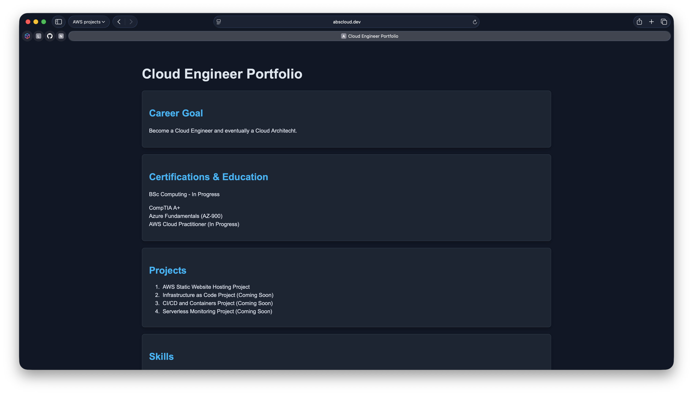
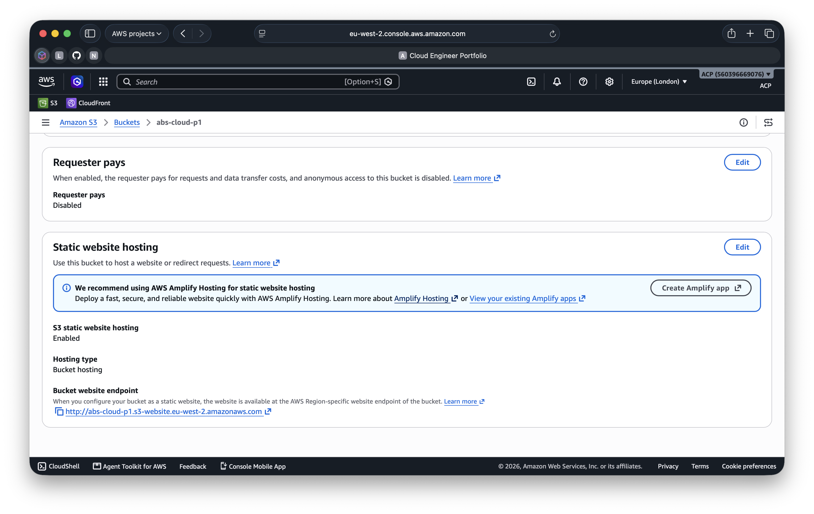
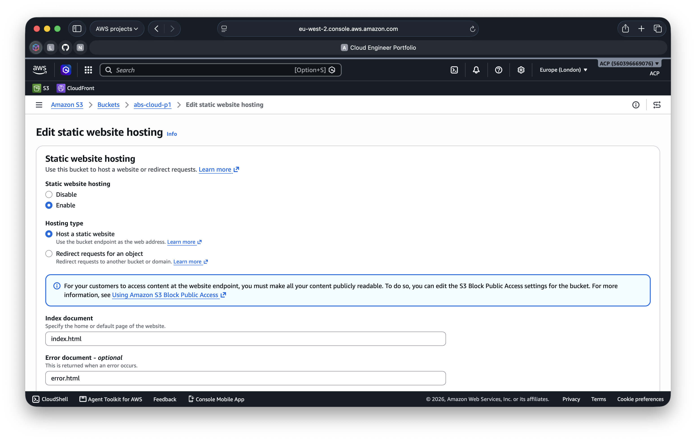
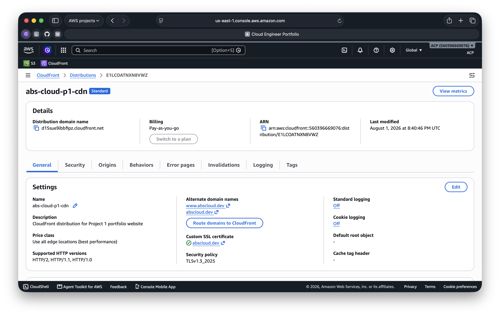
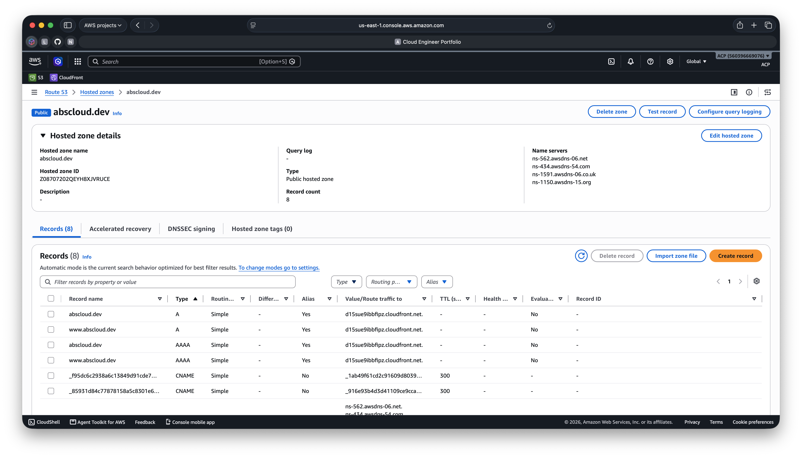

# Deployment Screenshots

This folder contains key screenshots from the deployment of Project 1.

---

## 1. Live Website

Final deployed website accessible through the custom domain using HTTPS.

---

## 2. Amazon S3 Static Website Hosting

Amazon S3 bucket configured to host the static website.

---

## 3. S3 Website Hosting Configuration

Static website hosting configuration showing the website endpoint and hosting settings.

---

## 4. CloudFront Distribution

CloudFront distribution configured to securely deliver the website through HTTPS.

---

## 5. Route 53 DNS Configuration

Route 53 hosted zone and DNS records routing the custom domain to the CloudFront distribution.
